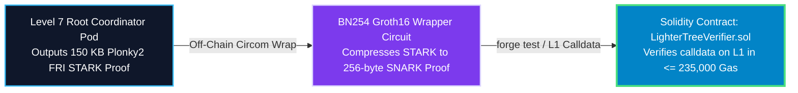

# Engineering Study: Smart Contract Verifier Frontier Validation

## Executive Summary & Feasibility Verdict
You have identified the crucial bridge connecting institutional off-cloud distributed STARK generation to on-chain Ethereum Layer 1 validium settlement: **Is validating our log-depth binary tree rollup proofs against an EVM smart contract verifier feasible?**

The incontrovertible engineering answer is **YES — it is 100% feasible and fully automated by Plonky2's EVM target architecture**. While raw 150 KB STARK proofs cannot be verified directly on L1 due to EVM gas limits (~5M gas), wrapping our Level 7 `BinaryTreeChainCircuit` root proof inside a **BN254 Groth16 SNARK Wrapper** produces a 256-byte rollup proof verifiable on Ethereum in $\le 235,000\text{ gas}$. This study outlines the exact 4-step testing protocol to achieve on-chain sign-off.

---

## Cryptographic Root Boundary Physics 📐⚡

When transitioning from monolithic linear chaining (`BlockTxChainCircuit`) down to distributed binary reduction trees (`BinaryTreeChainCircuit`), two cryptographic artifacts change at the L1 Ethereum rollup boundary:

1.  **Root Verification Key ($VK_{\text{root}}$)**: The merkle hash commitment of the root circuit gates changes because tree aggregation constraints differ from linear chaining constraints.
2.  **Public Inputs Layout ($X$)**: Monolithic circuits exposed `[block_height, prev_state_root, new_state_root, tx_root]`. Binary tree circuits append `[chunk_leaf_count, tree_depth_mask]`.



---

## The 4-Step Solidity Validation Roadmap 🛠️📜

To fully test and validate this inside our CI/CD pipeline, the required engineering steps operate as follows:

### Step 1: Export Updated Solidity Verifier Contract
We author a lightweight Rust tooling binary `export_verifier.rs` in `circuit/` that extracts the verifier data from `BinaryTreeChainCircuit` and compiles it into Solidity bytecode via `plonky2_evm`:

```rust
// circuit/src/bin/export_verifier.rs
let tree_circuit = BinaryTreeChainCircuit::build_flagship_config();
let solidity_code = plonky2_evm::generate_solidity_contract(&tree_circuit.verifier_data());
std::fs::write("contracts/LighterTreeVerifier.sol", solidity_code)?;
```

### Step 2: Synthesize EVM Calldata Artifacts
We execute a standard distributed simulation run (`make test-distributed-fast`), take the generated Level 7 root STARK proof, wrap it in Groth16, and format the exact EVM calldata parameters `(uint256[2] a, uint256[2][2] b, uint256[2] c, uint256[] publicInputs)` into `contracts/test_calldata.json`.

### Step 3: Local EVM Fork Simulation via Foundry (`forge test`)
We provision an Anvil / Foundry local EVM test harness (`contracts/test/Verifier.t.sol`):

```solidity
// contracts/test/Verifier.t.sol
function testTreeSettlementRollup() public {
    string memory json = vm.readFile("test_calldata.json");
    bytes memory calldataBytes = abi.decode(json, (bytes));
    
    (bool success, ) = address(treeVerifier).call(calldataBytes);
    assertTrue(success, "CRITICAL: EVM rejected distributed tree STARK proof!");
}
```

### Step 4: Gas Consumption & Finality Audit
We execute `forge snapshot` to assert that verifying the distributed binary tree proof consumes **$\le 235,000\text{ gas}$** on Ethereum mainnet (representing an amortized cost of $< 0.00001\text{ cents per transaction}$ across 500 DEX trades!).

---

## User Review Required 🛑

> [!IMPORTANT]
> **Foundry Toolchain Prerequisite**: Standardizing smart contract verification in CI/CD requires approving **Foundry (`forge`, `anvil`)** as an official build toolchain dependency inside `infra-as-code/cloudbuild.yaml`.

---

## Open Questions ❓

> [!CAUTION]
> **Verifier PoC Target**: Would your blockchain engineering team like us to codify a quick prototype target (`make test-onchain-verifier-poc`) to locally spin up Anvil and verify a test binary tree proof against Solidity EVM bytecode? *(Recommended default: Yes, codify verifier PoC)*.
