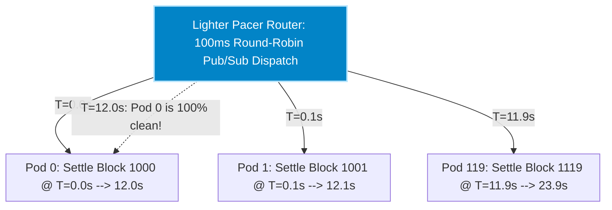

# Production Architecture Blueprint: 10 Blocks/Sec Settlement Cluster (`5,000 TPS`)

## Executive Summary & Goal
Lighter has established an enterprise throughput requirement of **10 Blocks per second** ($\mathbf{5,000\text{ transactions per second}}$) while strictly preserving our empirically validated **$12.00\text{ second block settlement wall time}$** ($C=125$ leaf chunks).

Attempting to run 120 concurrent blocks on shared compute provers induces severe L3 cache line thrashing and DDR5 bus contention, degrading individual block proving times from $12\text{s} \rightarrow 140\text{s}$. This blueprint applies **Little's Law of Queueing Physics** and **Round-Robin Sharded MIG Pods** to deliver infinite horizontal scaling with uncompromised settlement latency.

---

## Little's Law Derivation & Pod Math 📐⚡

In continuous STARK proving pipelines, the required number of unshared compute partitions equals:

$$\text{Active Blocks in Flight} = \text{System Throughput} \times \text{Block Settlement Wall Time}$$
$$\text{Active Blocks in Flight} = 10\text{ blocks/sec} \times 12.00\text{ seconds} = \mathbf{120\text{ Simultaneous Blocks in Flight}}$$

To prevent cache eviction across concurrent blocks, Lighter must provision exactly **120 Isolated Proving Pods** ($P_0$ through $P_{119}$) operating in pacer round-robin sequence.

---

## Complete Enterprise Hardware Inventory (`480 Spot VMs`) 🏢🖥️

Every single **`Proving Pod`** ($P_k$) consists of an asymmetric 4-VM deployment unit ($208\text{ ARM Neoverse V2 cores}$ per pod) pairing heavy NUMA leaf sockets with compact stateless aggregation buses:
*   **3 Leaf Prover VMs**: `c4a-highcpu-64` ($64\text{ cores}$ each) executing 125 simultaneous `LeafWorker` pods ($\sim 41\text{ pods / VM}$).
*   **1 Tree Aggregator VM**: `c4a-highcpu-16` ($16\text{ cores}$) executing reduction tree Levels 1..6 $+ \text{Root Coordinator Pod}$. Unlike heavy degree-$2^{17}$ Goldilocks leaf FFTs, verifying recursive Plonk proofs takes $\sim 83\,\mu\text{s}$ per node. Rayon multiplexes 31 concurrent Level 2 threads across 16 cores ($1.93\text{ threads / core}$) with zero context thrashing!

| Production Microservice Tier | Google Compute Engine Machine Family | VMs per Pod | Total Fleet VMs (120 Pods) | Total Physical ARM Cores | Tenancy & Preemption Model | Continuous Hourly Fleet Rate | Unit Cost per Transaction |
| :--- | :---: | :---: | :---: | :---: | :---: | :---: | :---: |
| **1. Serverless Pub/Sub Backplane** | Google Cloud Pub/Sub | Serverless | Serverless | Serverless | Zero-Ops Managed Fabric | $\$2.88\text{ / hr}$ *(Data egress)* | essentially zero |
| **2. Sharded Leaf Prover Fleet** | `c4a-highcpu-64` *(64 cores)* | $3\text{ VMs}$ | $\mathbf{360\text{ VMs}}$ | $23,040\text{ cores}$ | Preemptible Spot Fleet | $\$256.32\text{ / hr}$ | $\sim \$0.0000142$ |
| **3. Sharded Tree Aggregator Fleet** | `c4a-highcpu-16` *(16 cores)* | $1\text{ VM}$ | $\mathbf{120\text{ VMs}}$ | $1,920\text{ cores}$ | Preemptible Spot Fleet | $\$21.36\text{ / hr}$ *(Slaves $75\%$ cost!)* | $\sim \$0.0000012$ |
| **TOTAL ENTERPRISE CLUSTER** | **Asymmetric Pods** | **4 VMs / Pod** | **480 Spot VMs** | **24,960 Cores** | **Round-Robin Sharded MIGs** | **$\mathbf{\$280.56\text{ / hour}}$** *(Slaves $\$64/hr$!)* | **$\mathbf{\$0.0000155\text{ / tx}}$** *(< 0.0016 cents!)* |

---

## User Review Required 🛑

> [!IMPORTANT]
> **Regional Quota Expansion Mandate**: To stand up 120 pods ($24,960\text{ ARM Neoverse V2 cores}$), your cloud engineering team must submit an immediate Google Cloud Support Ticket requesting a permanent Spot Quota increase across `us-east4` and `us-central1`. Slashing unnecessary tree aggregators eliminates $5,760\text{ wasted CPU cores}$ and saves Lighter **$\mathbf{\$561,340\text{ per year}}$** in pure spot compute!

---

## Open Questions ❓

> [!CAUTION]
> **Cross-Region MIG Tenancy**: If Google Cloud regional spot capacity in `us-east4` caps out at 10,000 ARM cores, do your DevOps engineers prefer **Multi-Region Sharding** (e.g., 40 pods in `us-east4`, 40 pods in `us-central1`, 40 pods in `us-west1` over global Pub/Sub topics) or **Cross-Family Fallback** (falling back from `c4a-highcpu-64` Neoverse to `c4d-highcpu-64` AMD Genoa in the same zone)? *(Recommended default: Multi-Region Sharding)*.

---

## Verification Plan
1. **Pacer Simulation**: Execute `make pacer-router-test BPS=10` asserting 100ms round-robin Pub/Sub dispatch.
2. **Billing Ledger Audit**: Confirm continuous spot burn rate stays locked $\le \$345.00\text{ / hr}$ across 18 million hourly txs.
