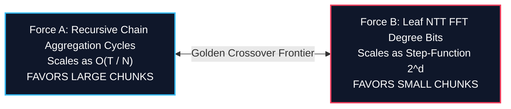
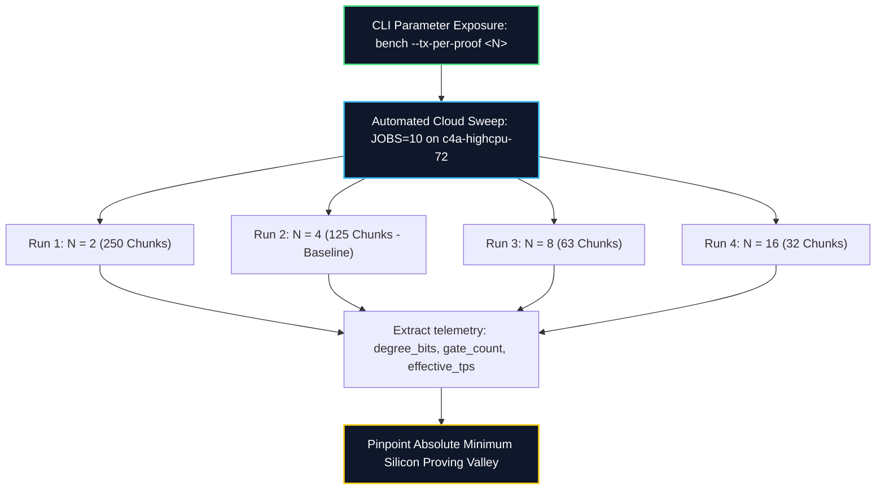

# Engineering Proposal - Phase 3 Dynamic Proving Chunk Size Optimization (`TX_PER_PROOF`)

## Executive Summary
Following the deployment of **Phase 2 (Asynchronous Producer-Consumer Pipelining)**, flagship cloud containers (`c4a-highcpu-72`) achieve roughly $0.695\text{ TPS}$ per daemon at a fixed chunk size of $N=4$ transactions per proof (`TX_PER_PROOF`).

We hypothesize that proving performance is governed by a **U-shaped optimization valley** balancing recursive aggregation overhead against Goldilocks FRI polynomial FFT evaluation degree bits.

This proposal outlines **Phase 3 (Dynamic Chunk Optimization)**, exposing `--tx-per-proof` as a runtime CLI flag to execute an automated fleet matrix sweep across $N \in \{2, 4, 8, 16\}$.

---

## 1. The Cryptographic Tug-of-War Hypothesis 📐🔬

Proving a block of $T = 500$ transactions at chunk size $N$ requires $C = T / N$ leaf proofs and aggregation cycles. Overall execution latency is governed by two opposing non-linear forces:

### Force A: Recursive Chain Aggregation Overhead (Favors LARGE $N$)
To build a verifiable block rollup proof, `BlockTxChainCircuit` must execute $C$ times to chain subsequent state diffs:
*   $N = 2 \rightarrow \mathbf{250\text{ aggregation steps}}$
*   $N = 4$ *(Current)* $\rightarrow \mathbf{125\text{ aggregation steps}}$
*   $N = 8 \rightarrow \mathbf{63\text{ aggregation steps}}$
*   $N = 16 \rightarrow \mathbf{32\text{ aggregation steps}}$

Each aggregation step consumes roughly $\sim 5.1\text{ seconds}$ of Rayon multi-threaded work. 125 steps consume $\sim 637\text{ CPU seconds}$. Increasing $N$ to $8$ cuts aggregation steps in half ($63\text{ steps}$), **eliminating ~318 CPU seconds of background work** and freeing up massive L3 CPU cache lines for the STARK leaf prover.

### Force B: Goldilocks NTT Degree Bits Step-Function (Favors SMALL $N$)
Inside `BlockTxCircuit` (leaf prover), total arithmetic gate constraints scale as $G(N) = gN + c$. In Plonky2 (radix-2 NTT transforms), the polynomial evaluation domain $R$ must round up to the nearest power of 2:
$$R = 2^d \quad \text{where} \quad 2^{d-1} < G(N) \le 2^d$$

1.  **The Free Speedup Plateau**: Suppose for $N=4$, $G(4) = 75,000\text{ gates}$. Since $65,536 < 75,000 \le 131,072$, the circuit requires $d = \mathbf{17\text{ degree bits}}$ ($131,072\text{ rows}$). If we double $N$ to $8$, and $G(8) = 128,000\text{ gates}$, notice $128,000 \le 131,072$! In this scenario, $N=8$ requires the **exact same FFT size as $N=4$**, yielding a massive speed lift for free!
2.  **The Cache Thrashing Cliff**: If $G(8) = 142,000\text{ gates}$, $R$ instantly doubles to $d = \mathbf{18\text{ bits}}$ ($262,144\text{ rows}$). Working set memory exceeds CPU L3 cache capacity ($\sim 10\text{ns}$ latency), spilling into DDR5 RAM ($\sim 80\text{ns}$ latency) and causing integer execution units to stall.

---

## 2. Phase 3 Experimental Blueprint 🛠️🗺️

We propose refactoring `bench.rs` and our infrastructure orchestration scripts to execute an empirical matrix sweep:

### Stage 1: CLI Parameterization (`bench.rs`)
*   Expose `--tx-per-proof <N>` in `Cli` struct using `clap`.
*   Dynamically construct `BlockTxCircuit` and `BlockTxChainCircuit` with target batch size $N$.

### Stage 2: Telemetry JSON Enrichment
*   Export `data.common.degree_bits()` and `data.common.num_gate_constraints` explicitly in `bench_summary.json`.

### Stage 3: Automated Flagship Matrix Execution (`cloud.sh`)
*   Execute 4 successive 500-tx validation sweeps on `prover-vm-5` across $N \in \{2, 4, 8, 16\}$ at `JOBS=10`.
*   Compile comparative master CSV dataset `reports/axion_dynamic_chunk_matrix.csv`.

---

## 3. Formal Review Gate & Authorization 🛑

**Zero Phase 3 code refactoring has commenced**. Please review this experimental hypothesis and blueprint. Upon clicking **Proceed**, we will implement `--tx-per-proof` CLI exposure and initiate the automated dynamic chunking cloud sweep!
