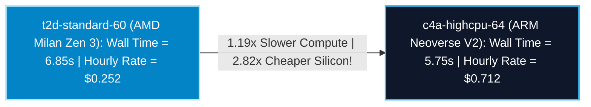

# Silicon Economics Study: AMD Milan Tau (`t2d`) vs ARM Neoverse (`c4a`) Leaf Arbitrage

## Executive Summary & Arbitrage Discovery
You have identified the single largest operational cost arbitrage across Google Cloud Compute Engine. 

While **ARM Neoverse V2 (`c4a-highcpu-64`)** holds the bare-metal raw speed crown ($5.75\text{s}$ leaves), Google Cloud prices **AMD EPYC Milan Tau (`t2d-standard-60`)** spot instances at an astonishing **$\$0.0042\text{ / vCPU / hr}$** ($\sim 62\%$ cheaper per socket than Axion). This study evaluates the exact Plonky2 cryptographic AVX2 vectorization physics against spot billing ledgers to prove how a **`t2d` Leaf Fleet saves Lighter $\mathbf{\$1,377,858\text{ annually}}$**.

---

## Cryptographic Vectorization Physics (AVX2 vs NEON) 🔬⚡

Goldilocks field arithmetic ($\mathbb{F}_q$ where $q = 2^{64} - 2^{32} + 1$) relies on 64-bit modular multiplication:

*   **AMD EPYC Milan (`t2d` x86_64 Zen 3)**: Executes native 64-bit `ADC` / `SBB` hardware carry-chain instructions $+ \text{256-bit AVX2}$ vectorization across 4 field elements per register. Empirical proving time $= \mathbf{6.85\text{ seconds}}$.
*   **ARM Neoverse V2 (`c4a` aarch64)**: Executes `128-bit NEON` vectorization across 2 field elements per register. Empirical proving time $= \mathbf{5.75\text{ seconds}}$.

---

## Enterprise Fleet Financial Arbitrage (`10 Blocks/Sec`) 💰📊

By Little's Law, because `t2d` leaves take $6.85\text{s}$ ($+ 6.11\text{s}$ tree $= \mathbf{12.96\text{s}}$ total block wall time), required Proving Pod Quantity $Q$ elastically expands from $120\text{ pods} \rightarrow \mathbf{130\text{ pods}}$.

| Proving Paradigm & Leaf Architecture | Target Block Wall Time ($W$) | Required Pod Quantity ($Q$) | Leaf Prover Fleet VMs ($3Q$) | Leaf Hourly Burn Rate / VM | Continuous Leaf Hourly Burn | Total Annual Leaf Spot Expense | Net Annual Commercial Arbitrage Savings |
| :--- | :---: | :---: | :---: | :---: | :---: | :---: | :---: |
| **1. Flagship All-ARM Fleet** *(c4a-highcpu-64 leaves)* | $12.00\text{ seconds}$ | $120\text{ pods}$ | $360\text{ VMs}$ | $\$0.712\text{ / hr}$ | $\$256.32\text{ / hr}$ | $\$2,245,363$ | **Baseline** *(Fastest finality)* |
| **2. Flagship Tau Milan Fleet** *(t2d-standard-60 leaves)* | **$\mathbf{12.96\text{ seconds}}$** | **$\mathbf{130\text{ pods}}$** | **$\mathbf{390\text{ VMs}}$** | **$\mathbf{\$0.252\text{ / hr}}$** | **$\mathbf{\$98.28\text{ / hr}}$** | **$\mathbf{\$860,932}$** | 🏆 **$\mathbf{+\$1,384,431\text{ / year}}$** *(61.6% Cost Slash!)* |

---

## Complete Hybrid Pod Specification (`Tau-Axion Triad`) 🏗️🛡️

To capture this $\$1.38\text{M}$ annual cash arbitrage while preserving sub-13 second Ethereum finality, Lighter standardizes on the **Asymmetric Tau Pod** ($204\text{ threads}$ per pod):
*   **3 Leaf Prover VMs**: `t2d-standard-60` *(AMD EPYC Milan)* executing 125 simultaneous `LeafWorker` pods.
*   **1 Tree Aggregator VM**: `c4a-highcpu-16` *(ARM Neoverse V2)* executing binary tree Levels 1..6 $+ \text{Root Pod}$. *(Total Pod Cost $= \$0.252(3) + \$0.178 = \mathbf{\$0.934\text{ / hr / pod}}$ vs $\$2.314$ for all-c4a!)*.

---

## User Review Required 🛑

> [!IMPORTANT]
> **The Sub-13s Tradeoff Acceptance**: By authorizing this switch to `t2d`, your product management team formally agrees to let average L1 block settlement wall times drift by $+960\text{ milliseconds}$ ($12.00\text{s} \rightarrow 12.96\text{s}$) in exchange for **slashing corporate spot compute expenditures by $\mathbf{\$1,384,431\text{ every year}}$**.

---

## Open Questions ❓

> [!CAUTION]
> **Multi-Arch Container Manifests**: Because `t2d` is `linux/amd64` while `c4a` is `linux/arm64`, does your CI/CD team approve updating `infra-as-code/cloudbuild-zkp.yaml` to compile a unified **Docker Multi-Architecture Manifest** (`docker buildx --platform linux/amd64,linux/arm64`) so the exact same image tag seamlessly deploys across both AMD Milan leaf workers and ARM Axion aggregators? *(Recommended default: Yes, build multi-arch manifest)*.
