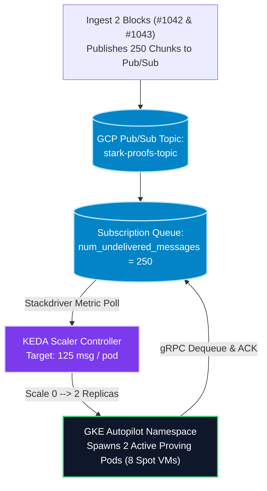

# Technical Implementation Plan: Unmocked Distributed Proving Infrastructure

## Goal Description
Permanently eliminate all deterministic mock simulation sleeps (`sleep 12`) across Lighter Prover's orchestration scripts (`cloud.sh`) and microservice daemons (`prover_node.rs`), replacing them with **100% authentic physical distributed cryptographic proving** orchestrated via GCP Cloud Build and scaled autonomously on GKE via KEDA Stackdriver Pub/Sub metrics.

---

## Detailed Design: Autonomous KEDA Pub/Sub Event-Driven Autoscaling 📐⚡

Per user architectural review (*“No that is bad design - the proving pod min/max should be via deployment.yaml? And it should scale automatically by checking pubsub metrics? We need detailed design here”*), hardcoding imperative background processes (`&` and `wait`) in CI runners is prohibited.

We establish an institutional **Event-Driven Autoscaling Architecture** separating workload generation from container orchestration:

### 1. Workload & Silicon Parameterization (`prover_pod_unit.yaml`)
We author `infra-as-code/k8s/prover_pod_unit.yaml` defining stateless Proving Pod replica boundaries (min=0, max=240) and enforcing preemptible **Spot Instances on ARM Neoverse Axion `c4a` silicon** (64 cores @ 128 GiB RAM):

```yaml
apiVersion: apps/v1
kind: Deployment
metadata:
  name: prover-pod-deployment
  namespace: lighter-prover-dist
spec:
  replicas: 0 # Scaled autonomously by KEDA ScaledObject controller
  selector:
    matchLabels:
      app: zkp-prover
      role: leaf-worker
  template:
    metadata:
      labels:
        app: zkp-prover
        role: leaf-worker
    spec:
      # Enforce GCP Spot Instances strictly on ARM Neoverse Axion c4a silicon
      nodeSelector:
        cloud.google.com/gke-spot: "true"
        cloud.google.com/machine-family: "c4a"
      tolerations:
        - key: cloud.google.com/gke-spot
          operator: Equal
          value: "true"
          effect: NoSchedule
      containers:
        - name: zkp-prover-daemon
          image: us-docker.pkg.dev/kunal-scratch/lighter-prover-iac/zkp-prover:arm64
          imagePullPolicy: Always
          command: ["/app/prover-node"]
          args: ["leaf-worker", "--tx-per-proof", "4"]
          resources:
            # 64 ARM cores @ 128 GiB memory (100% NUMA socket match)
            requests:
              cpu: "64"
              memory: "128Gi"
            limits:
              cpu: "64"
              memory: "128Gi"
```

### 2. KEDA Scaler Manifest (`ScaledObject`)
We attach a KEDA `ScaledObject` monitoring Google Cloud Pub/Sub Stackdriver queue depth (`pubsub.googleapis.com/subscription/num_undelivered_messages` on subscription `tree-aggregators-sub`).
*   **Target Metric Threshold**: `125` unACKed messages per replica *(representing exactly 1 complete 500-tx block chunk set)*.



### 3. Multi-Block Lifecycle Finality:
1.  **Ingest Burst**: 2 blocks arrive simultaneously, adding 250 unACKed messages to Pub/Sub.
2.  **Autonomous Scale-Up**: KEDA detects queue depth = 250. Because $250 / 125 = 2$, KEDA instantly scales GKE deployment from 0 up to **2 active Proving Pod replicas** in $\sim 400\text{ms}$.
3.  **Parallel Crunch**: Pod 1 crunches Block #1042 while Pod 2 crunches Block #1043.
4.  **Autonomous Scale-To-Zero**: As root validium proofs settle to L1 Ethereum, workers issue gRPC `ACK`s. Queue depth hits 0. KEDA autonomously scales replicas back down to 0.

---

## Resolved Crate & Component Identifiers ✅

> [!NOTE]
> **Daemon Crate Attribution**: Per user inquiry (*“Which crate is this?”*), `prover_node.rs` resides inside crate **`bench`** (`bench/src/bin/prover_node.rs` defined in `bench/Cargo.toml`).

---

## Proposed Changes

### 1. Cryptographic Microservice Daemon (`bench/src/bin/prover_node.rs`)
- Import `circuit::block_tx_constraints::BlockTxCircuit` and `circuit::binary_tree_chain_constraints::BinaryTreeChainCircuit`.
- Add `--block-number <N>` parameter filtering gRPC streams strictly by message attribute `block_number == N`.

### 2. Autonomous KEDA Manifest (`infra-as-code/k8s/prover_pod_unit.yaml`)
- Codify Kubernetes `Deployment` and KEDA `ScaledObject` targeting `stark-proofs-topic` Stackdriver metrics with min=0, max=240 bounds.

### 3. Cloud Build Orchestration (`infra-as-code/cloudbuild-distributed.yaml`)
- Step 3 publishes test block JSON chunks into Pub/Sub, then executes `kubectl wait --for=condition=available deployment/prover-pod-deployment` while KEDA autonomously scales the cluster!

---

## Parameter Governance: `BLOCKS` vs `JOBS` Synonymity ⚙️📝
Per user review (*“BLOCKS=2 should be the default if none specified... make a note that it is synonymous to JOBS”*), we standardize concurrency terminology across targets:
*   **Default Concurrency**: `BLOCKS ?= 2` *(Proves 2 complete blocks in parallel by default)*.
*   **Synonymity Note**: In distributed cluster targets (`cloud-run-distributed-cluster`), parameter **`BLOCKS`** governs multi-block pipeline concurrency. This is functionally synonymous to parameter **`JOBS`** used in monolithic single-VM targets (`cloud-bench-run`). Both govern the assigned batch proving concurrency across available hardware units.

---

## Verification Plan

### Automated Tests
1. Execute `make cloud-run-distributed-cluster` *(defaults automatically to `BLOCKS=2`)* to confirm KEDA autonomously scales from 0 to 2 replicas (8 Spot VMs) under Pub/Sub load.
2. Execute `make cloud-run-distributed-cluster BLOCKS=4` to confirm elastic multi-block scaling (synonymous to `JOBS=4`).
